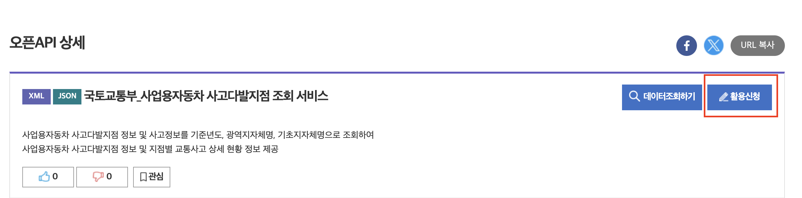
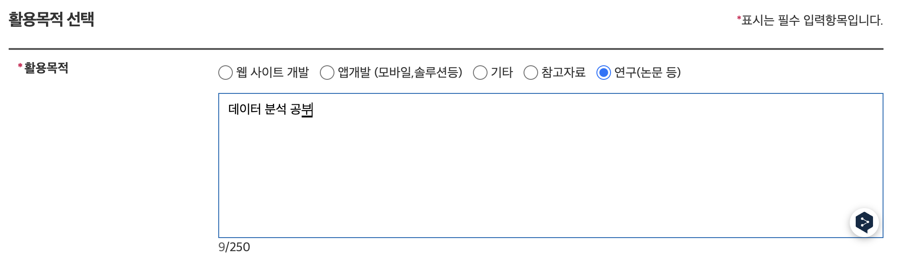
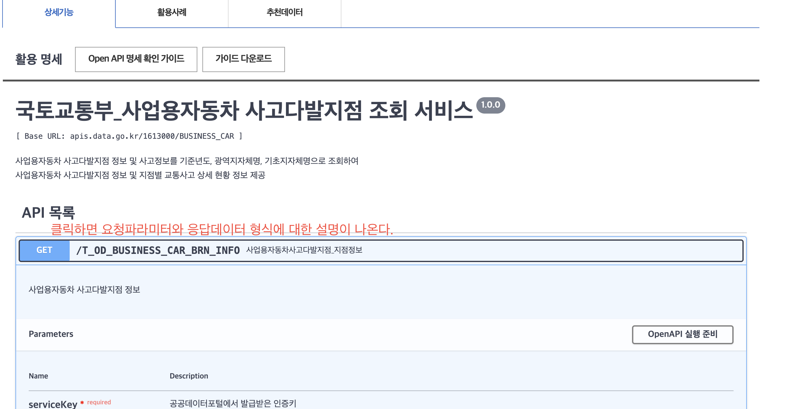

- 로그인
- 원하는 자료를 검색한다.
- 활용신청

- 활용목적을 선택하고 신청버튼(최 하단) 클릭

- 신청한 내역 확인
  - `마이페이지 > 데이터 활용 > Open API > 활용신청 현황`
  - 지금까지 신청한 내역이 보이고 선택해서 `개발계정 상세`로 들어간다.
- `개발계정 상세` 에서 인증키를 복사한다.
- 데이터 상세 페이지(개발계정 상세 페이지에서는 제목 옆 상세설명 버튼 클릭)로 이동 후 요청 방식을 확인한다.

- **주의:** http로 연결한다.